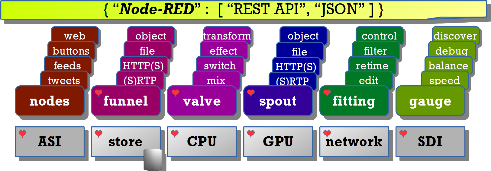
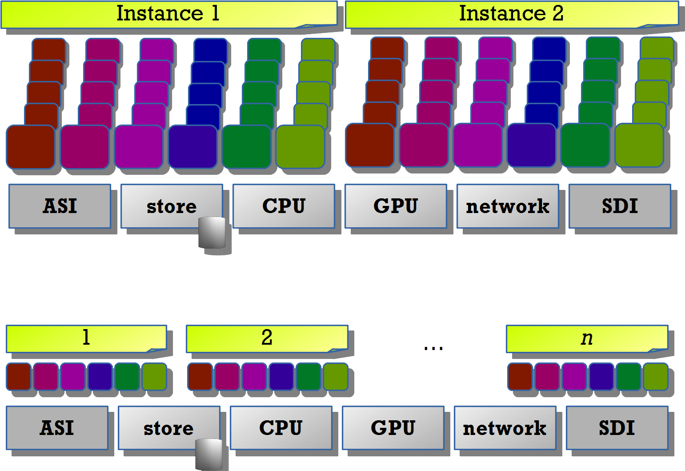
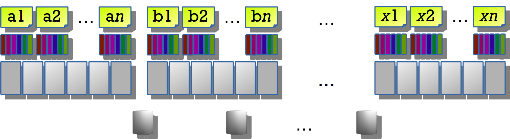
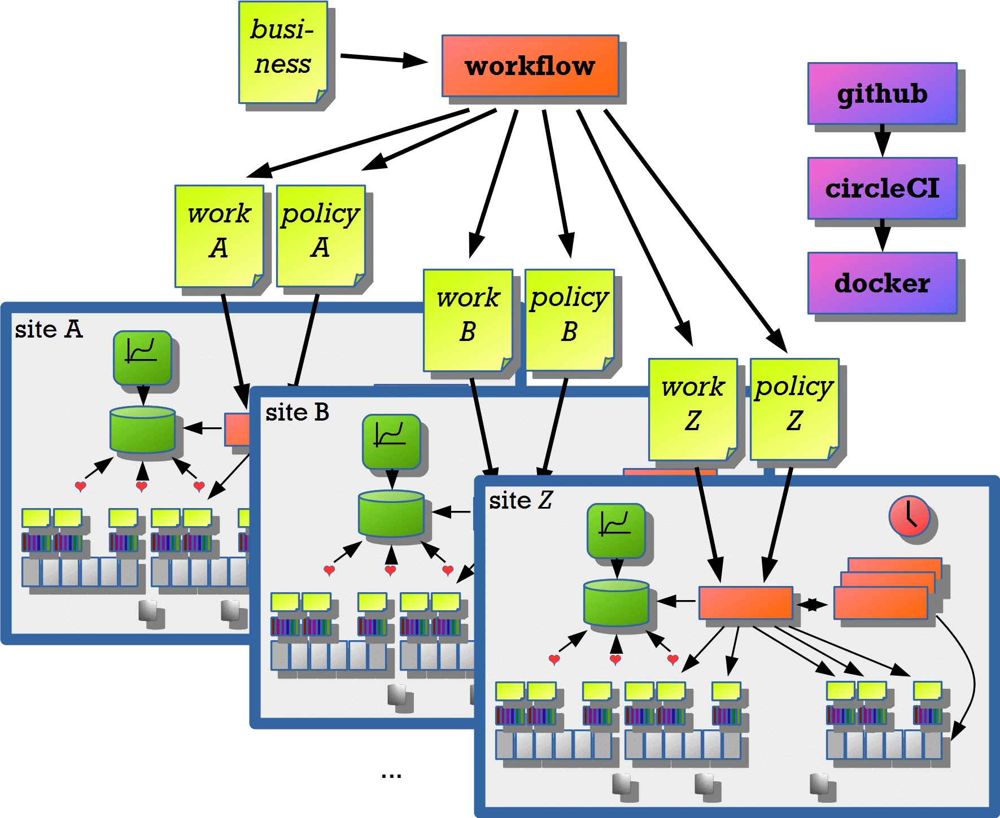

# organist
Orchestrating the nodes and pulling out all the stops.

## Streampunk service architecture

### Nodes on a single Node-RED instance

### Scale up in the same system

### Scale out to many systems

### Local context

### Global context(images/global-context.png)

