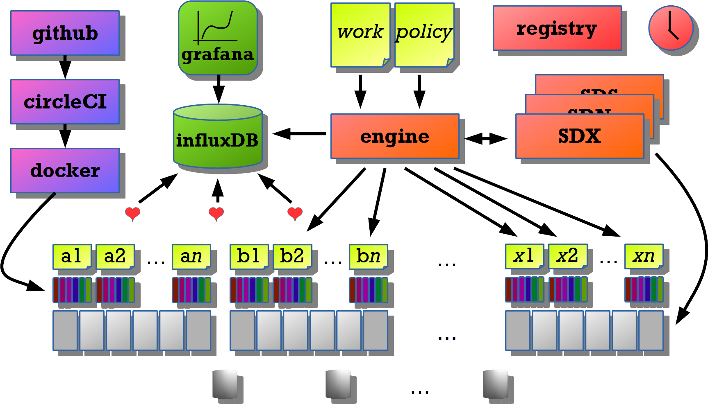

# Organist
Orchestrating the nodes and pulling out all the stops.

## New FIMS and NMOS - a demonstration of building the JT-NM jigsaw

It all starts with the conceptual model from the [JT-NM Reference Architecture](file:///C:/users/sparkpunk/Google%20Drive/Streampunk%20Drive/tech/specs/jtnm/JT-NMReferenceArchitecturev1.0%20150904%20FINAL.pdf). The elements of this model can be broken down into:

* transport standards and file wrappers - grains;
* [NMOS](http://www.nmos.tv/) - flows, sources, senders, receivers, devices, nodes, registry;
* [FIMS](http://www.fims.tv/):
  * business services: capabilities, tasks, content & product management.
  * cross cutting services: continuous integration, measurement, monitoring and resource management.

An emerging vision of how to put the pieces of the jigsaw together.

## Dynamic software infrastructure

### Nodes on a single Node-RED instance

### Scale up in the same system

### Scale out to many systems

### Local context

Each element in the global context can be the sender or receiver of one or more streams.

### Global context

## Framework for services

The aim is to use the existing [FIMS](/fims-tv/fims) models as a template for a lightweight, micro-services style approach to setting up and tearing down virtual infrastructure to achieve specific jobs. In particular, the FIMS state model and job resource should be a basis for further development.

In the demo, we run a javascript program from the command line that ....

1. Run up dynamorse and ledger.
2. Receives the details of work to do, content to use and duration.
3. Deploy infrastructure.
4. Runs a transcode process for two minutes.
5. Stops the transcode.

The content item is described as a TVClip using the semantic definition at [schema.org](http://www.schema.org/).

