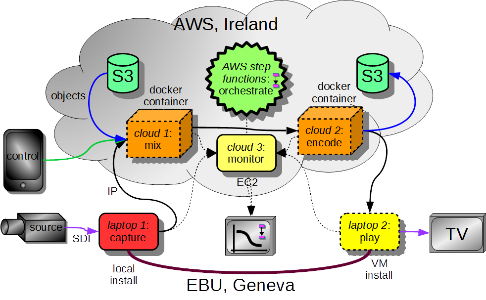
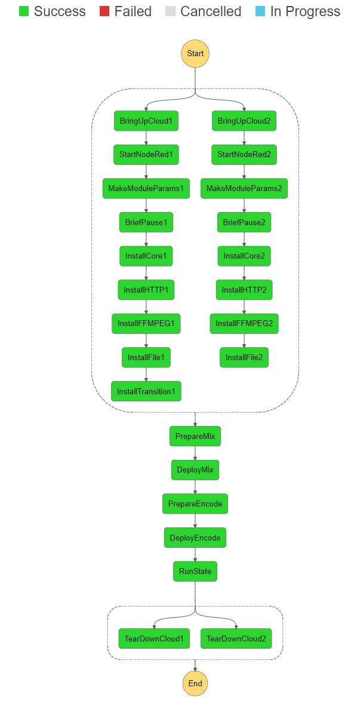

# Orchestration on AWS

This project contains a prototype _dynamic software infrastructure_ orchestrator using [AWS Step Functions](https://aws.amazon.com/step-functions/). The orchestrator uses [AWS Lambda](https://aws.amazon.com/lambda/) functions to:

* start two EC2 instances of the given type;
* control the creation of [Node-RED docker containers](https://nodered.org/docs/platforms/docker) run as tasks in the [AWS EC2 Container Service](https://aws.amazon.com/ecs/).
* start [Node-RED](https://nodered.org/) and install the [core module for dynamorse](https://flows.nodered.org/node/node-red-contrib-dynamorse-core);
* add in other dynaorse modules as required, e.g. [ffmpeg](https://flows.nodered.org/node/node-red-contrib-dynamorse-ffmpeg) for transcoding and [http-io](https://flows.nodered.org/node/node-red-contrib-dynamorse-http-io) for media transport;
* create a video mixer on one instance and a video encoder on another;
* run for a while;
* tear everything down and tidy up.

This is a prototype demonstration of what could be achieved to orchestrate dynamic creation and management of infrastructure for professional media production using the public cloud. The step funnction was created as part of the demonstration illustrated below:



Also included in this package is a configuration to set up an [Elastic Stack](https://www.elastic.co/products) in a container in the cloud, allowing metrics to be collected and analysed from Node-RED flows and the containers on which they run.

# Installation

## Bits and pieces

This project includes some resources to help set up the step functions:

* [lambdas](./lambdas) - a Node.JS module containing all the code for the lambda functions in use and a copy of the dependent modules;
* [tasks](./tasks) - includes EC2 container service task definition for a cluster containing a single Node-RED container;
* [step_functions](./step_functions) - Orchestration recipe, a configuration of the step functions orchestrator written in [Amazon States Language](https://states-language.net/spec.html).
* [logstash](./logstash) - configuration for [logstash](https://www.elastic.co/products/logstash) to work with dynamorse modules.

## Steps summary

Given an AWS account, follow the steps below - with a degree of flexibility to your environment - to get an orchestrator running from scratch:

1. In the [lambdas](./lambdas) folder, run `npm install`. Zip up the entire folder and upload to an S3 bucket of your choice. Copy the link to the object in the bucket.
2. Create a policy for the execution of step functions, called e.g. `StatesExecutionPolucy-eu-west-1`. Follow the steps outlined by AWS at http://docs.aws.amazon.com/step-functions/latest/dg/procedure-create-iam-role.html
3. In IAM, create a role for lambda functions to use the AWS SDK, called e.g. `LambdaSDKAccess`. Attach policies `AmazonEC2FullAccess`, `AmazonEC2ContainerServiceFullAccess`, `AWSLambdaExecute` and the states execution policy created in step 2.
4. Create lambda functions for the following functions in the `index.js` file of the lambdas. For each function, specify a name, select `Node.JS 6.X` and select an existing S3 bucket as the code location, copying in the link from step 1. Each should have its handler set to `index.<function_name>` with an existing role set to the one created in step 3. Do this for each of: `terminateInstance`, `newInstance`, `showInstances`, `installNodeREDModule`, `deployNodeREDModule`, `makeModuleParams`, `makeAnEncode`, `makeAMix`, `startNodeRED`.
5. Create a step function using the [step_functions/dynamicNTS.json] file. Go through each of the refences to lambda functions and update them to ARNs for lambda functions in your own account. Attach the policy created in step 2.
6. In the EC2 section, create a security group called `Node-RED security group` in the default VPC. Add inbound rules for:
 * Custom UDP, port 8000, source `0.0.0.0/0`, _old logging protocol_.
 * Custom TCP, port 3101, source `0.0.0.0/0`, _NMOS node API access_.
 * Custom TCP, ports 8712 - 8713, source `0.0.0.0/0`, _HTTP/S default transport ports_.
 * Custom TCP, ports 1880, source `0.0.0.0/0`, _Node-RED web UI and REST API access_.
7. Create an EC2 container service _task definition_ called `Node-RED-family` and based on [tasks/Node-Red-Family.json]. Take specific note of the value set for property `awslogs-group`, e.g. `NTS`.
8. In CloudWatch, create a new AWS log group with the name identified in step 7, e.g. `NTS`.

## Running

Create a new execution of the step function. Use the following example JSON as the basis for the input, changing the instance type to an appropriate size:

```json
{
  "mixParams": {
    "instanceName": "mixer",
    "instanceType": "t2.micro",
    "modules": [
      "core",
      "http-io",
      "ffmpeg",
      "file-io",
      "transition"
    ]
  },
  "encodeParams": {
    "instanceName": "encoder",
    "instanceType": "t2.micro",
    "modules": [
      "core",
      "http-io",
      "ffmpeg",
      "file-io"
    ]
  }
}
```

If all is successful, the execution should complete and the associated state machine look like:


